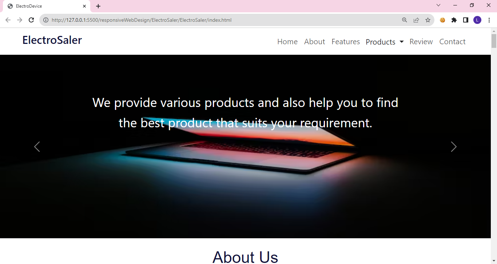
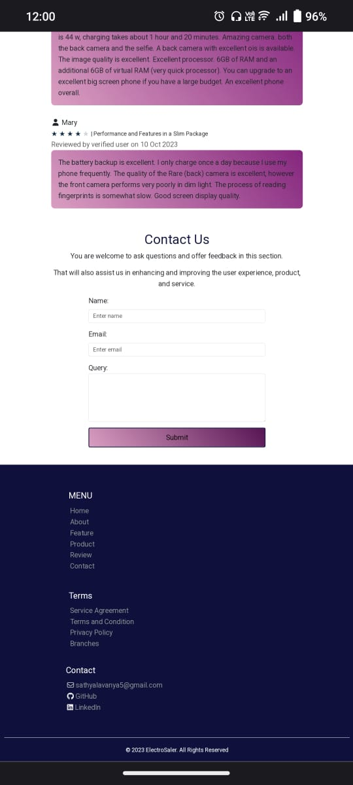

# ElectroSaler - Online Electronics Store

**ElectroSale** is an online electronics store website built with HTML, CSS, and Bootstrap. It offers a seamless shopping experience with a user-friendly interface and various sections for easy navigation.

## Features

- **Navigation Bar**: A responsive navigation bar for easy access to different sections.
- **Carousel Images**: Eye-catching carousel images showcasing featured products.
- **About Us**: Learn about our company's mission and values.
- **Product Showcase**: Browse our latest products with detailed descriptions.
- **Customer Reviews**: Check out testimonials from happy customers.
- **Contact Us**: Get in touch with us with questions, comments, or support.
- **Footer**: Find essential links and contact information in the footer.

## Usage

1. Clone the repository to your local machine.
2. Open the `index.html` file in your web browser.
3. Explore the website and experience the seamless shopping interface.

## Customization

You can customize the ElectroSale website to fit your specific needs:

- Modify product information in the HTML.
- Customize the color scheme and styling in the CSS.
- Add or remove sections as required.

## Technologies Used

- HTML
- CSS
- Bootstrap

## Author

- [Lavanya S](https://github.com/Lavanya-Sathya)
  
## Credits

- Built with HTML, CSS, and Bootstrap.
- Icon by [FontAwesome](https://fontawesome.com/).
- Background image from [Unsplash](https://unsplash.com/).
- Product images from [amazon](https://www.amazon.in/).

## Screenshots

